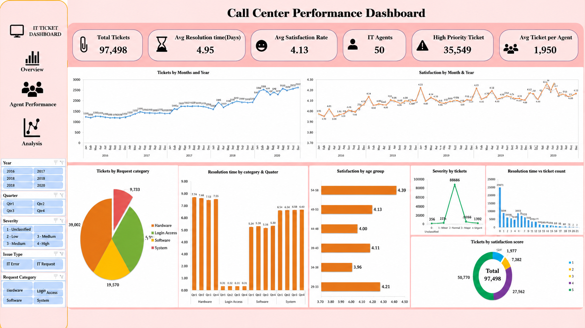

# 📞 Call Center Performance Dashboard

An interactive **Call Center Performance Dashboard** built using **Power BI** to analyze ticket management, agent performance, customer satisfaction, and operational efficiency. This project transforms raw data into actionable business insights through interactive visualizations and KPI tracking.

---

## 📌 Project Overview

The objective of this project is to evaluate the performance of a call center by analyzing ticket trends, agent efficiency, customer satisfaction, and resolution time. The dashboard helps identify improvement opportunities and supports data-driven decision-making.

---

## 🎯 Business Objectives

- Analyze overall ticket volume and trends.
- Evaluate IT agent performance.
- Monitor customer satisfaction.
- Measure ticket resolution efficiency.
- Identify high-priority ticket patterns.
- Generate actionable business insights.

---

## 📊 Dashboard KPIs

| KPI | Value |
|------|-------|
| Total Tickets | 97,498 |
| Average Resolution Time | 4.95 Days |
| Customer Satisfaction | 4.13 / 5 |
| Total IT Agents | 50 |
| High Priority Tickets | 35,549 |
| Average Tickets per Agent | 1,950 |

---

## 📈 Dashboard Features

- Interactive KPI Cards
- Ticket Trend Analysis
- Customer Satisfaction Trend
- Request Category Analysis
- Resolution Time Analysis
- Ticket Severity Analysis
- Satisfaction Score Distribution
- Resolution Time Distribution
- Dynamic Filters and Slicers

---

## 🔍 Key Insights

- Ticket volume has increased consistently over the years, indicating growing support demand.
- Hardware and System requests account for the highest number of tickets.
- Customer satisfaction remained above **4/5**, reflecting consistent service quality despite the increasing workload.
- High-priority tickets make up a significant portion of all requests, requiring faster response strategies.
- Resolution time varies across request categories, highlighting opportunities for process optimization.

---

## 💡 Recommendations

- Prioritize high-priority tickets with faster response workflows.
- Provide targeted training for agents handling complex request categories.
- Continuously monitor KPIs to improve resolution time.
- Optimize staffing based on ticket trends and workload distribution.
- Focus on maintaining high customer satisfaction while reducing response time.

---

## 🛠️ Tools & Technologies

- Microsoft Excel
- Power BI
- Power Query
- DAX
- Data Modeling
- Data Visualization

---

## 📷 Dashboard Preview



---

## 📂 Repository Structure

```
Call-Center-Performance-Dashboard/
│
│   └── Call Center Performance.pptx
│   └── Call Center Dataset.xlsx
│   └── dashboard.png
│
└── README.md
```

> **If you built the dashboard in Excel instead of Power BI, replace the `.pbix` file with your `.xlsx` dashboard.**

---

## 🚀 Skills Demonstrated

- Business Analysis
- KPI Development
- Dashboard Design
- Data Cleaning
- Data Transformation
- Power Query
- DAX
- Data Visualization
- Storytelling with Data

---

## 📬 Feedback

I would love to hear your feedback and suggestions. Feel free to connect with me on LinkedIn or open an issue in this repository.

⭐ If you found this project helpful, don't forget to **Star** this repository!
